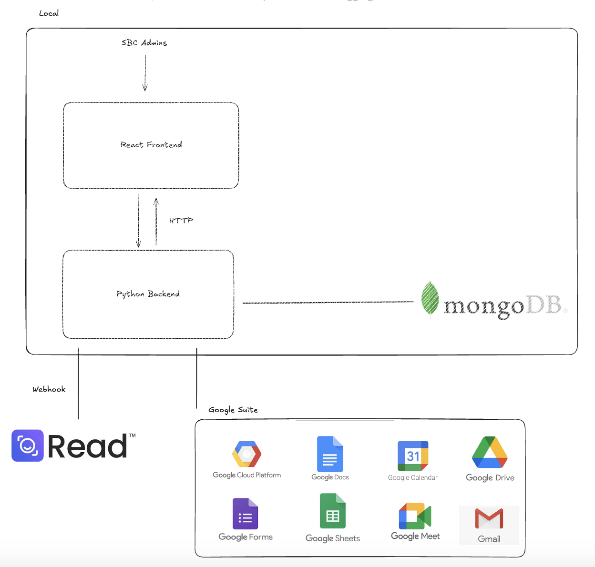

# 

<p align="center">
  <a href="#-about">About</a> &nbsp;&bull;&nbsp;
  <a href="#-features-overview">Features Overview</a> &nbsp;&bull;&nbsp;
  <a href="#-usage">Usage</a> &nbsp;&bull;&nbsp;
  <a href="#-security">Security</a> &nbsp;&bull;&nbsp;
  <a href="#-tech-stack">Tech Stack</a> &nbsp;&bull;&nbsp;
  <a href="#-solution-architecture">Solution Architecture</a> &nbsp;&bull;&nbsp;
  <a href="#-how-to-run-developement-locally">How to run development locally</a>
</p>

## 💡 About

### Project Objective

The primary goal of this project is to develop a cost-effective digital PA system tailored for the administrators of the Singapore Book Council (SBC).

We understand that:

- SBC is a non-profit organization that organizes numerous events and programmes annually.
- As a small organization, SBC lacks the resources to hire a full-time personal assistants (PAs).

### Potential Issues

1. **Task Management Inefficiencies**  
   Administrators may struggle to manage the multitude of tasks associated with their programmes, leading to inefficiencies.

2. **Time Constraints and Burnout**  
   A heavy workload and tight schedules may cause stress and burnout among administrators.

3. **High Cost of Hiring a PA**  
   Hiring a full-time PA is expensive, which is not feasible for SBC as a non-profit organization.

## 📌 Our Solution

### WriteNow!

**Get Organized. Automate Tasks. Do It All, Write Now!**

WriteNow! is a **web application platform** designed to streamline task and program management for administrators. With tools for effortless organization and advanced automation, WriteNow! ensures you can tackle everything—_Write Now_.

### Why WriteNow?

- Simplify task and programme management to stay organized.
- Automate repetitive workflows to save time.

### Smart Automation

Powered by **Large Language Model (LLM) technology**, WriteNow! automates key workflows, including:

- Scheduling meetings.
- Generating meeting minutes.
- Summarizing emails.

## ✨ Features Overview

- **Organization Platform**  
  Effortlessly organize tasks and administrators within their respective programs.

- **Task Management**  
  Create, assign, track, and update tasks—whether for yourself or others.

- **Meeting Management**  
  Automate meeting scheduling and generate AI-powered meeting minutes.

- **Document Management**  
  Automatically create document templates and assign related tasks seamlessly.

- **Email Management**  
  Summarize emails instantly and convert them into actionable tasks.

- **AI Assistant**  
  Let the AI assistant craft detailed plans of action for your tasks.

## 📖 Usage

- **Dashboard**

  The dashboard provides a centralised view of the following main components:
  1. **Tasks**: Displays a list of tasks assigned to or created by you.
  2. **Email Summaries**: Shows AI-generated short summaries of your emails for quick review.
  3. **Calendar**: Highlights your upcoming events and schedules.


- **Email Management**

  The email page is designed to streamline your workflow by summarising and organizing your emails effectively:

  - **Inbox**
    - Displays a list of your recent emails, each accompanied by a short AI-generated summary.
    - Clicking on an email opens a longer summary of the selected email's entire thread.

  - **Email Thread View**
    - Shows a longer AI-generated summary for all emails within the same thread.
    - Provides the total count of emails within the thread.
    - Includes actionable options:
      - **View on Gmail**: Opens the selected email thread directly in Gmail for further actions like replying.
      - **Create Task**: Lets you create a task related to the email.


- **Task Creation with AI**

  Apart from the basic _Create Task_ option, WriteNow also provides an alternative solution to streamline task management with _Create Task with AI_.

  When selecting either _Create Task_ or _Create Task with AI_, a **Create Task Drawer** will appear, allowing you to:  
  - Assign the task to yourself or a team member.
  - Customise the task details, such as title, description, deadline, and assignee.
  
  When **creating a task with AI**,
  - AI will auto-generate task content based on the email context.
  - The task name and description will be auto-generated according to the summarised email thread's content.


  This feature ensures seamless integration between your email and task management workflows, saving time and reducing manual effort.


- **Programmes**

  The Programmes page provides an organized display of various programmes available for users to explore and participate in.
  These include events, workshops, festivals, and other activities related to writing, publishing, storytelling, and more. Key features include:

  1. **Upcoming Events Section**: Lists all scheduled programmes with details like event name, date, time, location, and description.
  2. **Filter by Date and Category**: Users can filter programmes by specific dates or categories to quickly find relevant events.
  3. **Programme Details**: Each event includes a "View Details" button, allowing users to access more information about the event.
  4. **Create Programme Button**: Admins or authorized users can add new programmes by clicking the "Create Programme" button.


- **Meetings**


## 🔒 Security

Our solution comprises of several security features to keep user data safe.

### Authentication

OAuth 2.0 for authentication, allowing users to login securly through their google accounts and manage what services the app can access

### Data Security

Secure processing of sensitive user credentials on the server side, not exposing them to the malicious client users

### Data Storage

MongoDB Atlas for secure storage of user data, with encryption at rest and in transit

## 🧑‍💻 Tech Stack


## 📐 Solution Architecture

# 

**_Frontend_**

Website served to the end users. Connects to the backend to fetch data via HTTP requests.

**_Backend_**

Server that handles all the HTTP requests from the frontend, database operations and to google cloud services.

**_MongoDB_**

Database that stores all the data for the application.

**_Google Cloud Platform_**

Google services that are used in the application.

**_ReadAI_**

ReadAI is a service that uses Large Language Models to transcribe google meet recordings. It sends the transcription to the backend via Webhook, where is it further processed.

## 📖 How to run development locally

### Frontend

1. Change the directory to the frontend directory
2. Run the following command to install the dependencies:

```bash
npm install
```

3. Run the following command to start the frontend:

```bash
npm start
```

### Backend

Google Cloud Project:

1. Create a Google Cloud Project and enable the following APIs:

- Calendar API
- Gmail API
- Google Workspace Meetings API
- Google Workspace Drive API

2. Add test users to OAuth consent screen

3. Set the redirect URI to `http://your_backend_url/auth/callback`

4. Retrive the following credentials from the Google Cloud Console:

- Client ID (GOOGLE_CLIENT_ID)
- Client Secret (GOOGLE_CLIENT_SECRET)
- Token Endpoint (GOOGLE_TOKEN_ENDPOINT)
- Redirect URI (REDIRECT_URI)

ReadAI:

1. Create a Gmail account (add to OAuth consent screen)
2. Use the Gmail account to register for a ReadAI account.
3. Enable the Calendar integration in the ReadAI account.
4. Enable Webhook integration in the ReadAI account. The webhook URL is `http://your_backend_url/save_transcript_and_analysis`.
5. Retrieve the following credentials:

- Gmail of the ReadAI account

Templates:

1. Using the Gmail account created above, create a

- Public google doc template for reports
- Public google sheet template for budget
- Public google form template for forms

2. Retrieve the following credentials:

- Google Doc template ID (REPORT_TEMPLATE_ID)
- Google Sheet template ID (FORM_TEMPLATE_ID)
- Google Form template ID (BUDGET_TEMPLATE_ID)

OpenAI:

1. Create an OpenAI account and retrieve the API key (OPEN_API_KEY)

MongoDB:

1. Download MongoDB Community Server from https://www.mongodb.com/try/download/community
2. Install MongoDB Compass from https://www.mongodb.com/try/download/compass
3. Create a local database and retrieve the connection string (MONGODB_URL) and database name (DATABASE_NAME).

Backend:

1. Change the directory to the backend directory
2. Download python 3.11 from https://www.python.org/downloads/
3. Install dependencies.

```bash
pip install -r requirements.txt
```

4. Create a `.env` file in the root of thebackend directory with the following variables:

```bash
GOOGLE_CLIENT_ID
GOOGLE_CLIENT_SECRET
GOOGLE_TOKEN_ENDPOINT
REDIRECT_URI
MONGODB_URL
DATABASE_NAME
READ_AI_BOT_EMAIL
OPEN_API_KEY
BUDGET_TEMPLATE_ID
REPORT_TEMPLATE_ID
FORM_TEMPLATE_ID
FRONTEND_URL
```

5. Run the server

```bash
fastapi dev main.py
```

6. Open the browser and go to `http://127.0.0.1:8000/docs` to see the API documentation.
